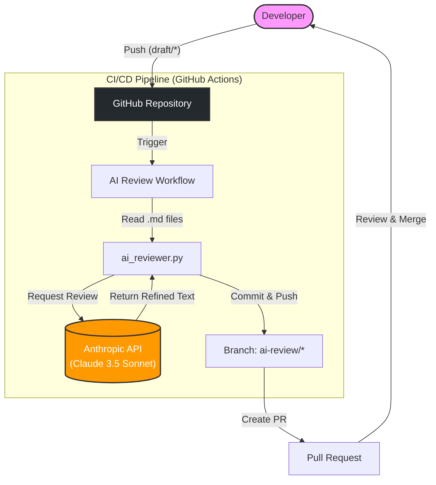

# 🤖 AI Docs: Claude 3.5 Powered Reviewer


**「Docs as Code」と「AI Agent」を融合させた、次世代のドキュメント執筆ワークフローです。**

Markdown で書かれた技術記事やドキュメントを `draft/` ブランチに Push するだけで、Claude 3 が自動的に校正・レビューを行い、修正案を **Pull Request** として提案します。

## 🏗 Architecture



## ✨ Features

1. 完全自動レビュー: Push をトリガーに、AI がドキュメントの誤字脱字、トーン&マナー、構成をチェックします。
2. Claude 3.5 Sonnet (Latest) 採用: 最新の LLM を使用し、文脈を理解した高度な修正提案を行います。
3. GitHub Native: 修正提案は Pull Request の「差分（Diff）」として提示されるため、人間は確認してマージするだけです。
4. Configurable: プロンプト（ai_reviewer.py）を編集することで、AI の「レビュアーとしての人格」や「厳しさ」を自由に調整可能です。

## 🚀 How to Use

1. **記事を書く**: リポジトリをクローンし、Markdown ファイルを作成・編集します。

2. **ドラフト用ブランチを作成して Push**: `draft/` から始まるブランチ名で Push することがトリガー条件です。

   ```bash
   git checkout -b draft/my-new-article
   git add .
   git commit -m "feat: 記事の下書きを作成"
   git push origin draft/my-new-article
   ```

3. **AI からの PR を待つ**: GitHub Actions が起動し、約 30 秒〜1 分後に 🤖 AI Review: ... というタイトルの Pull Request が自動作成されます。

4. **確認・マージ**: PR の[Files changed]タブで、AI による修正提案（Diff）を確認してください。 問題なければマージし、記事を完成させます。

## ⚙️ Setup

このワークフローをあなたのリポジトリで使用するには、以下の設定が必要です。

**Prerequisites**

- Anthropic API Key (Credit があること)

**Repository Secrets**
GitHub リポジトリの Settings > Secrets and variables > Actions に

Name: ANTHROPIC_API_KEY
Value: Anthropic Console から取得した API キー (sk-ant-...)

を追加してください。

※ GITHUB_TOKEN は GitHub Actions 標準のものを使用するため、設定不要です。

## 🛠 Tech Stack

- LLM: Anthropic Claude 3.5 Sonnet
- Orchestration: GitHub Actions
- Logic: Python 3.10 + anthropic SDK

## 📝 Customization

`ai_reviewer.py` 内の `SYSTEM_PROMPT` を変更することで、レビューの観点をカスタマイズできます。

```Python
SYSTEM_PROMPT = """
あなたは辛口の技術レビュアーです。
論理的飛躍や、エビデンスの不足を厳しく指摘してください...
"""
```
